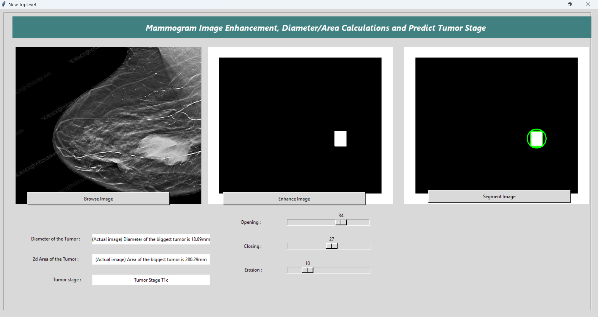

## Breast-Cancer-Mammogram-Image-enhancement-and-Tumor-Size-calculation

## Run the mam.py file to access the GUI

Breast cancer is the most well-known cancer affecting women worldwide. Over recent decades, the incidence of breast cancer has risen globally. Studies have demonstrated that the most significant increment will be among women in developing countries, most of whom live in the Asian region.  More than one diagnostic modality is used for breast cancer screening, like computed tomography, resonance magnetic imaging, and ultrasound. All of these modalities aren't enough to detect all lesions of the breast despite their characteristics such as high sensitivity of soft tissue detection. Digital mammography is more prevalent in detecting breast lesions than other diagnostic modalities.
Many types of techniques are used for mammography image detection such as edge-based transform, smoothing, noise removal, and extraction techniques. Therefore, it is necessary to have an efficient method to enhance and improve the mammography images to identify the tumour's size and location.
The methodology implemented in this project gives you an enhanced image of the tumour's location, and finally, the diameter, area and tumour stage will be displayed in the user interface. This enhancement will come in handy for Doctors to identify and diagnose breast cancer and its stage.

## Screenshots

##

